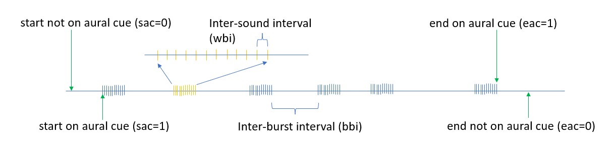

```{r setup, include=FALSE}
knitr::opts_chunk$set(echo = TRUE)
```

```{r,message=FALSE,warning=FALSE,echo=FALSE}
library(readxl)
library(tidyverse)
library(knitr)
#for the mixture models
library(mixtools)
library(ggplot2)
library(ggpubr)
```


# Introduction

Reliable methods for estimating animal abundance are fundamental for effective management and conservation of wildlife. Traditional survey methods to estimate animal abundance rely on visual detection of animals. However, many animals might be notoriously hard to see, but might produce sounds which can be easily detected using passive acoustics. In recent years passive acoustic monitoring density estimation has seen a steep increase in use, given that under some settings, it might be more effective than traditional methods, allowing for continous monitoring of wildlife under settings which human observers might not even be able to operate. Examples of the use of passive acoustic data to estimate animal abundance include a wide variety of sound producing taxa, namely fish @Rowell2017, birds @Dawson2009, frogs @Measey2016, gibbons @Kidney2016 and cetaceans @Marques2009. 

There are many ways one can use animal produced sounds to derive animal density, but perhaps one of the most appealing is cue counting. Cue counting is an indirect method of estimating abundance, where instead of focussing on the animals, we rely on the sounds detected on acoustic sensors. These might be hydrophones in the water and microphones in terrestrial environments, covering the area for which we intend estimate density. To convert the number of detected sounds we need to account for (1) sensor performance, which might include both the effective area of detection of the sensors, or equivalently a detection probability, and their probability of generating false positives, and (2) an estimate of cue production rate, the number of sounds produce per animal per unit time. Here we focus on the latter, cue production. Dealing with the first component is not the focus of this paper, but @Marques2013b provide an overview of what is involved in the former regarding sensor performance characterization.

When conducting a passive acoustic density estimation survey, reliable cue rates for the time and place a survey is being conducted are required (e.g. @Marques2013b). However, perhaps surprising, little is know about the frequency of sound production for many species of animals. Therefore, to obtain cue rates for passive acoustic density estimation, dedicated data collection is typically required. At sea, cue rates are often estimated by placing animal borne tags with acoustic sensors on individuals. By counting the number of cues produced over the tag duration for a sample of animals cue rates can be obtained (e.g. @Warren2017). However, on terrestrial animals, like birds, focal follows of animals are typically considered (e.g. @Sebastian-Gonzalez2018). If the start and end of a focal follow are independent of the mechanism by which animals produce sounds, then we are home free. One just needs a random sample of focal animals and using these we can obtain an average cue rate for the population of interest. However, if the inclusion of an animal in the focal follow also depends on its acoustic state, in particular, if we start and/or end the focal follow at the time of sound emission, we might introduce bias in the sound production rate. As an example, it might be expected that when finding birds for focal folows, birds that are vocally active are easier to find than those that are silent. If that were the case, we would over sample vocally active birds, overestimating the cue rate. This would then have a know on effect inducing negative bias in abundance or density estimates.

Here we present one such scenario, that might be plausible for a variety of taxa, where sounds are produced in pulses interspersed with silences. Animals will be therefore tendentiously included in a focal follow when in a burst of sounds, and then the focal follow will stop when the animal is no longer detected, also typically acoustically. This will, unless corrected for, induce bias in cue rates. Inspired by a real case study of passive acoustic density estimation for the Common Chaffinch, we propose a method to correct for the possible bias in start and end times of the focal follows. This leverages on a modified estimator for cue rates that adjusts the time considered as the recording period for each focal follow. We discuss the implications for estimates of cue rates from individual animals and the implications for passive acoustic density estimation via cue counting, which extends beyond the strict case of animals that produce sounds in bursts. 


# Methods

## Silence-burst sound patterns

Consider a situation where animals tend to be silent for some periods, interspersed with periods where sounds are emitted in a relatively regular manner for a short period of time. We refer to such sound process describing the emission times of sounds of interest by a given species as a silence-burst sound pattern. We define the time between two successive sounds as an inter-sound-interval ($isi$), and we can distinguish two types of $isi$'s, (1) the time between successive sounds within a burst, referred as a within-burst-interval ($wbi$) and (2) the sound in between bursts,referred as a between-burst-interval ($bbi$). Figure 1 represents sounds produced by one such silence-burst hypothetical  animal.

We propose a novel way to estimate the mean $bbi$ value based on focal follows, where the times of sound emission are recorded, and use that to correct the recording time associated with each focal follow. By doing so we avoid potential biases in defining these the start and end of the recording period for each focal follow. We observe $isi$'s. Instead of defining strictly what are the observations that correspond to either $wbi$'s or $bbi$', we model the $isi$'s as a two-part finite mixture (e.g. Gaussian mixtures), and assume that the component with the smaller mean corresponds to distribution of the $wbi$, while the component with the higher mean will correspond to the $bbi$. Therefore, all the data can used in an integrated procedure to estimate the distribution of the $bbi$'s, and in particular their mean. The estimate of the mean $bbi$ will be required for the cue rate estimator, as described below.



When we want to estimate cue production rates for terrestrial animals, required to convert estimates of sound density into estimates of animal density, we often select animals over which focal follows are conducted. During the focal follow a human observer will record the times of each sound emission, and at the end typically the number of sounds emitted divided by the focal follow duration are used as estimates of the individual cue production rate. A population averaged cue rate is obtained as an average of the individual cue rates.

Typically, however, two potential sources of bias might be at play:

1. if an animal is first detected by an aural cue, then the animal is most likely to be in a sound producing mode, here in particular, in a burst. Since this is the most likely way an animal will be found, we will tend to start recording during bursts, which means that the cue rate will be biased high;

2. if the animal is last detected exclusively aurally, then we are not sure whether the animal has left the area or not since it was last heard, and if it did, when it did, and so there is uncertainty about the time one should record to end the focal follow. The only natural choice is the last sound detected, but then this is likely to be the last sound in a burst, and again this will bias the cue rate estimate up.

Since both 1 and 2 are highly likely and both lead to overestimating cue rates, these will both contribute to underestimate animal density.

In this note we propose an approach to alleviate the problem, inspired by a real case study of Chaffinch ($Fringilla$ $coelebs$) in Portugal. 

## The proposed estimator

Considering a focal follow, where the start $T_{si}$ and end $T_{ei}$ of the focal follow are independent with respect to the song production mechanism, an unbiased estimate of individual sound production rate for individual $i$, given a total observation period $T_i=T_{ei}-T_{si}$ and $n_{ci}$ detected cues will be, by definition of cue production rate 

$$\hat r_i=\frac{n_{ci}}{T_{ei}-T_{si}} = \frac{n_{ci}}{T_i}.$$
Therefore, the overall cue rate based on a random sample of $n$ focal follows will be given by

$$\hat r=\frac{\sum_{i=1}^n \hat r_i}{n}.$$


However, if the inclusion of the animal in a focal follow or the end of the focal follow are dependent on the sound production mechanism, as would be likely for sound producing species, also detected aurally, this cue rate estimator might be expected to be biased up.

Here we propose a more sensible estimator. It essentially  adjusts the time of the focal follow duration based on the data collected. Two possible options are described below. 

Consider $T_{csi}$ and $T_{cei}$ to be the times of the first sound detected and the time of the last sound detected, respectively. Additionally, consider two indicator variables, the Start on an Aural Cue ($sac$) and the End on Aural Cue ($eac$). Consider that $sac$=1 if the start of a focal follow was on an aural cue, $sac=0$ otherwise. Therefore if $sac=1$, $T_{cs}=T_s$. On the other hand, $eac$=1 if the end of the focal follow was defined at the last aural cue detected, otherwise $eac=0$. Therefore if $eac=1$, $T_{ce}=T_e$. We suggest that if $sac=0$ the data are truncated such that the recording time starts at $T_{cs}$, and if $eac=0$ we truncate the data such that the recording time ends at $T_{ce}$, while adjusting for the average $bbi$ at the start and end of the recording time, leading to the estimator 

$$\hat r_i= \frac{n_{ci}}{\frac{\hat{bbi}}{2}+(T_{cei}-T_{csi})+\frac{\hat{bbi}}{2}}= \frac{n_{ci}}{(T_{cei}-T_{csi})+\hat{bbi}}.$$

The focal follow duration will then be assumed to correspond to the time difference between the first and the last cue detected to which we add an estimate of the $bbi$. This corresponds to half the $bbi$ at the start and to half the $bbi$ at the end of the focal follow. This assumes that, if the focal follow start and end coincided with a cue production time, or if we truncate the recording time to make it so, instead of taking these as the observed start and end of the focal follow, we must add to the recording time defined by the first and last sound detected, the average amount of time that an animal would be silent in between bursts.

Note that for any given focal follow, if $sac=0$ one might assume that the start was random with respect to the sound process. On the other hand if $eac=0$, one might assume that the end of the focal follow was random with respect to the sound generating process. If the mean value for $T_{c1}-Ts|sac=0$ or $T_e-T_{cn}|eac=0$ is considerably different from $bbi/2$ it is likely that the start and end of the follow are actually not independent with respect to the sound generating process. In such cases, the above procedure is recommended. If one is willing to assume that the start and end of a focal follow not coinciding with a sound are independent of the sound producing mechanism, then we could use the following estimator for animal's $i$ cue rate

$$\hat r_i= \frac{n_c}{sac\frac{\hat{bbi}}{2}+(T_{cei}-T_{csi})+eac\frac{\hat{bbi}}{2}}$$

where one-half of the $bbi$ is added only if the start for a given animal focal follow was an acoustic cue, and one half of the $bbi$ is added only if the end for a given animal follow was an acoustic cue. As before, considering a random sample of $n$ animals for which focal follows are available, the empirical mean of the individual cue rates provides a population average.

To obtain an estimate of precision for the population's cue rate we propose to consider a non-parametric bootstrap, where the individual animals are taken as the independent sampling units. This allows to propagate into the cue rate precision the variability associated with estimating the mean $bbi$.

The proposed methods are illustrated below for a dataset of Common Chaffinch, which after a number of focal follows, we identified as having a clear silence-burst sound pattern. We compare the results obtained using a naive approach with our new estimator. We a priori hypothesized that the naive approach would be biased high for estimating cue rate and correspondingly biased low for estimating density. As can be seen below, our a priori hypothesis was wrong.

# The example dataset

## Study area: 

The study was carried out in Companhia das Lezírias, a large farm in Santarém, Portugal, with around 11 000 ha. Cork oak woodlands are the most common habitat present , making up to 75% of the total forested area. Oak woodlands ($Quercus$ $suber$ and $Quercus$ $rotundifolia$) managed as silvopastoral systems, known as montados in Portugal and dehesas in Spain @PintoCorreia2011, and are recognized as an excellent example of balance between socio-economic  development and biodiversity conservation @Leal2016 @Telleria2007.

## Chosen Species:

The Common Chaffinch ($Fringilla~coelebs$) is one of the most common species in these oak woodland area. Given its distinct and characteristic song compared to other species, it makes it easier to identify individuals of this species in studies where we have to apply acoustic monitoring methods.

## Data collection using recorders:

The fieldwork occurred between March and May of 2022, and data was collected using automatic sound recorders called AudioMoth (AM, Open Acoustics Devices). AudioMoths are small and light weighted, affordable recorders with an inbuilt microphone that can be programmed to record within specific filters and schedules, ranging in frequencies up to 348 kHz and recording throughout 24h with 5s intervals between each recording @Hill2018 @Hill2019.

For this study, AudioMoths were programmed to record at 48 kHz, which is the recommended  frequency for birds, and they were set to start recording the first 4 hours after sunrise, for periods of 1 hour with a 5 seconds interval between each recording. No surveys were conducted under rainy or windy conditions.

Birds produce two main types of vocalizations: songs and calls. Songs are usually loud and often long, more complex vocalizations that are mostly used by males to defend their territory, and they are formed by syllables (basic units), phrases (repeated syllables) and trills (rapid repetitions of 3 or more simple syllables) @Gill2006. Calls, on the other hand, are short and simple vocalizations, that are used by both males and females that can be warning calls, distress calls, flight calls, nest calls and flock calls @Gill2006.
In this study, we used songs as our vocalization-type focus, given the fact that it will be a longer and easier to detect vocalization in an area with other vocalizing species.
Regarding cue rates estimation, fieldwork was based on focal follows of individual chaffinches. The observer walked in the field and, once an individual was spotted, we registered every time it sang during a maximum of 12 minutes. During the  data collection, if by any chance we would lose track of the individual we were following or we couldn't be certain anymore that it was the same individual, we would stop the timer and stop registering data for that individual. After each bird focal follow we would change location to reduce the likelihood of repeated inclusion in our sample of the same individuals.

## Results for Appendix

Here we read the data from the focal follows

```{r,readdata,echo=FALSE}
#read the data from the focal follows
cantos <- read_excel("data/dados_cantos.xlsx")
```

The times of calls are recorded as the fraction of the day since the beginning of the day, at midnight, so we recode these fractions of the day to represent seconds.

```{r}
#recode inter-event-intervals (iei) to be in seconds 
cantos$iei<-cantos$iei*((24*60*60))
```

We pre-process the data to get which of the events are inter-sound-intervals. Most of those records for which `Event=call` correspond indeed to $isi$'s, but the notable exception are:

* those which end with a `call`, which will have no `iei`, and
* those for focal follows not initiated at a sound, labelled as `Event=rec.start`. For these, the first `iei` corresponds to a time between the start of the focal follow and the first call produced, and hence must be removed for when modelling $isi$'s. 

To account for both of these we create a new column labelled `isi` with an indicator that takes the value 1 is the `iei` corresponds to an `isi`, and 0 otherwise. Only those $iei$ with `isi=TRUE` will be considered for modelling the $isi$ components

```{r}
cantos$isi<-1
#removing iei's that are not isi's
#those not calls are not isi's
cantos$isi[cantos$Event!="call"]<-0
#those that are calls but the end of the ofcal follow is with a call are 0 (these always happen with iei=NA)
cantos$isi[is.na(cantos$iei)]<-0
#those for focal follows not initiated at a sound, labelled as `Event=rec.start`
cantos$isi[which(cantos$Event=="rec.start")+1]<-0
```


summaries by bird:

```{r}
#compute cue rates per animal etc
#cr is cue rate per minute
# sounds: number of sounds produced
# n: number of records, at most "sounds"+2 (if sac=0 and eac=0), at least "sounds" (if sac=1 and eac=1)
# start1: recording start and first sound if sac=1
# start2: the first sound if sac=0
# end1: recording end and last sound if eac=1
# end2: the last sound if eac=0
# dur1: the "standard" duration as in end time minus start time (in minutes)
# cr1: the conventional cue rate, number of sounds / duration
# sac: the indicator of whether recording started with a sound
# eac: the indicator of whether recording ended with a sound
crs.by.indiv<-cantos %>% group_by(Indiv) %>% summarise(sounds=sum(Event=="call"),n = n(),start1=min(Time),start2=Time[2],end1=max(Time),end2=sort(Time,decreasing =TRUE)[2],dur1=25*60*(end1-start1),cr1=sounds/dur1,sac=sac[1],eac=eac[1])
#adding dur2: the duration from the first to the last sound produced, in minutes
#this will be required for our suggested estimator
start<-with(crs.by.indiv,ifelse(sac==1,start1,start2))
end<-with(crs.by.indiv,ifelse(eac==1,end1,end2))
crs.by.indiv$dur2<-25*60*(end-start)
```

```{r}
#the isi times
st <- cantos %>% drop_na("isi")
```

We have a total of `r sum(cantos$isi=="C")` times of sound production obtained from focal follows of `r length(unique(cantos$Indiv))` individuals.

Individuals were followed on average for `r round(mean(crs.by.indiv$dur1),2)` minutes, ranging from `r round(min(crs.by.indiv$dur1),2)` to `r round(max(crs.by.indiv$dur1),2)` minutes. The distribution of these focal follow times is shown below:

```{r}
ggplot(crs.by.indiv,aes(x=1,y=dur1),fill="lightblue")+
  theme_bw()+geom_violin(fill="lightblue")+geom_jitter()+geom_hline(yintercept=mean(crs.by.indiv$dur1))
```

We can take a look at the data.

```{r}
ggplot(cantos, aes(x=iei)) + geom_histogram() + xlab("Inter-event-intervals (s)")
#hist(cantos$iei, breaks = 20, main="", xlab="Inter-event-intervals (s)")
```

Only `r sum(cantos$iei[cantos$isi==1]>60)` of the $isi$'s, corresponding to `r round(sum(cantos$iei[cantos$isi==1]>60)/sum(cantos$isi),2)` % of the $isi$'s, are longer than 1 minute. Below we focus the attention on those `isi` that are under a minute below:


```{r}
#hist truncated for iei <60s
ggplot(cantos[(cantos$isi==1 & cantos$iei<60),], aes(x=iei)) + geom_histogram() + xlab("Inter-event-intervals (s), truncated at 60 seconds")
#hist(cantos$iei[(cantos$isi==1 & cantos$iei<60),], main="", xlab="Inter-event-intervals (s), truncated at 60 seconds") 
```

The per animal cue rates are shown below:

```{r}
ggplot(crs.by.indiv,aes(x=1,y=cr1),fill="lightblue")+
  theme_bw()+geom_violin(fill="lightblue")+geom_jitter()+geom_hline(yintercept=mean(crs.by.indiv$cr1))
```

```{r}
ci.cr1<-t.test(crs.by.indiv$cr1)$conf.int
cv.cr1<-100*(sd(crs.by.indiv$cr1)/sqrt(nrow(crs.by.indiv)))/mean(crs.by.indiv$cr1)
```


The corresponding estimate of the average cue rate, estimated using a standard mean, is `r round(mean(crs.by.indiv$cr1),2)`, with 95% CI of `r round( ci.cr1[1],2)`-`r round(ci.cr1[2],2)`. The coefficient of variation is `r round(cv.cr1,2)` %.

Finally, we model the $isi$'s s a two-part mixture, as suggested above.

```{r}
#the isi's to model and separate into two components, one for bbi's and one for wbi's
isis<-cantos$iei[cantos$isi==1]
mixmdl = normalmixEM(isis,k=2)
#was checking the inclusion of a 3rd component - weirdly AIC seems to favour that
#mixmdl3 = normalmixEM(isis,k=3)
```

We can see what this two mixture distribution corresponds to:

```{r}
plot(mixmdl,which=2,breaks=seq(0,500,by=10))         
lines(density(isis), lty=2, lwd=2)
```

And a summary of the fitted two part mixture

```{r}
kable(summary(mixmdl))
```

```{r}
p.mix<-mixmdl$lambda
means.mix<-mixmdl$mu
sds.mix<-mixmdl$sigma

```

Note this implies that the mean value of the first component, corresponding to the $wbi$, is `r round(means.mix[1],2)` seconds, with a standard error of `r round(sds.mix[1],2)`, and we estimate that `r round(p.mix[1],2)` of the observations come from the $wbi$'s, while the mean value of the second component, corresponding to the $bbi$, is `r round(means.mix[2],2)` seconds, with a standard error of `r round(sds.mix[2],2)`, and we estimate that `r round(p.mix[2],2)` of the observations come from the $wbi$'s. Actually, this means that for each $bbi$ we have 0.85/0.15=`r round(p.mix[1]/p.mix[2])` $wbi$'s, or in other words, each call burst contains on average `r round(p.mix[1]/p.mix[2])` calls.

```{r}
crs.by.indiv$dur3<-with(crs.by.indiv,dur2+(means.mix[2]/60))
crs.by.indiv$cr2<-with(crs.by.indiv,sounds/dur3)
```

```{r}
cr.new<-mean(crs.by.indiv$cr2)
ci.cr2<-t.test(crs.by.indiv$cr2)$conf.int
cv.cr2<-100*(sd(crs.by.indiv$cr2)/sqrt(nrow(crs.by.indiv)))/mean(crs.by.indiv$cr2)
```

This would then lead to an estimate of cue rate of `r round(cr.new,2)`, with 95% CI of `r round( ci.cr2[1],2)`-`r round(ci.cr2[2],2)`. The coefficient of variation is `r round(cv.cr2,2)` %. 

The confidence interval above does not propagate the uncertainty in estimating the mean of the bbi's. To do so we could incorporate a non-parametric bootstrap procedure, resampling the birds subjected to focal follows.

```{r,warning=FALSE,message=FALSE,cache=FALSE,echo=TRUE,include=FALSE}
B<-999
cr.new.boot<-numeric(B)
bbis.boot<-numeric(B)
nsounds.boot<-numeric(B)
bird.codes<-unique(cantos$Indiv)
nbirds<-length(bird.codes)
for(i in 1:B){
  #select a sample of birds
  birds.boot<-sample(bird.codes,size = nbirds,replace = TRUE)
  #select the first bird data
  cantos.boot<-cantos[cantos$Indiv==birds.boot[1],]
  crs.by.indiv.boot<-crs.by.indiv[crs.by.indiv$Indiv==birds.boot[1],]
  for(j in 2:nbirds){
    #select all the remaining birds data
    cantos.boot<-rbind(cantos.boot,cantos[cantos$Indiv==birds.boot[j],])
    crs.by.indiv.boot<-rbind(crs.by.indiv.boot,crs.by.indiv[crs.by.indiv$Indiv==birds.boot[j],])
  }
  # fit the 2/component mixture model
  isis.boot<-cantos.boot$iei[cantos.boot$isi==1]
  mixmdl.boot <- normalmixEM(isis.boot,k=2,verb = FALSE)
  #note the use of max as sometimes the mixture reverses the means
  #i.e about 5% of the time the first mixture is the one with the higher mean
  bbis.boot[i] <- max(mixmdl.boot$mu)
  #mixmdl.boot$mu
  # get the durations
  crs.by.indiv.boot$dur3<-with(crs.by.indiv.boot,dur2+(bbis.boot[i]/60))
  # get the cue rates
  nsounds.boot[i]<-sum(crs.by.indiv.boot$sounds)
  crs.by.indiv.boot$cr2<-with(crs.by.indiv.boot,sounds/dur3)
  # get the mean cue rate
  cr.new.boot[i]<-mean(crs.by.indiv.boot$cr2)
}
quants<-quantile(cr.new.boot,probs = c(0.025,0.975))
#quants
#summary(bbis.boot)
#summary(nsounds.boot)
```

This leads to a point estimate of `r round(cr.new,2)` with corresponding 95% CV of `r round(quants[1],2)`-`r round(quants[2],2)`. This corresponds to a CV of `r round(100*sd(cr.new.boot)/cr.new,2)`.

## Results

We have a total of `r sum(cantos$isi=="C")` times of sound production obtained from focal follows of `r length(unique(cantos$Indiv))` individuals. Individuals were followed on average for `r round(mean(crs.by.indiv$dur1),2)` minutes, ranging from `r round(min(crs.by.indiv$dur1),2)` to `r round(max(crs.by.indiv$dur1),2)` minutes. The distribution of these focal follow times is shown in Figure 1.

```{r,Figure1,echo=FALSE,fig.caption = "Distribution of focal follow durations \\label{Fig1lab}"}
ggplot(crs.by.indiv,aes(x=1,y=dur1),fill="lightblue")+
  theme_bw()+geom_violin(fill="lightblue")+geom_jitter()+geom_hline(yintercept=mean(crs.by.indiv$dur1))
```

The times in between events are represented in figure 2. Only `r sum(cantos$iei[cantos$isi==1]>60)` of the $isi$'s, corresponding to `r round(sum(cantos$iei[cantos$isi==1]>60)/sum(cantos$isi),2)` % of the $isi$'s, are longer than 1 minute. We focus the attention on those `isi` that are under a minute (Figure 2, right panel).

```{r,Figure2, echo=FALSE}
fig2a<-ggplot(cantos, aes(x=iei)) + geom_histogram() + xlab("Inter-event-intervals (s)")
#hist(cantos$iei, breaks = 20, main="", xlab="Inter-event-intervals (s)")
#hist truncated for iei <60s
fig2b<-ggplot(cantos[(cantos$isi==1 & cantos$iei<60),], aes(x=iei)) + geom_histogram() + xlab("Inter-event-intervals (s), truncated at 60 seconds")
#hist(cantos$iei[(cantos$isi==1 & cantos$iei<60),], main="", xlab="Inter-event-intervals (s), truncated at 60 seconds") 
ggarrange(fig2a,fig2b)
```

Based on the number of sounds recorded divided by the recording duration, conventional estimates of cue rates per animal are shown in figure 3. The corresponding estimate of the average cue rate, estimated using a standard mean, is `r round(mean(crs.by.indiv$cr1),2)`, with 95% CI of `r round( ci.cr1[1],2)`-`r round(ci.cr1[2],2)`. The coefficient of variation is `r round(cv.cr1,2)` %. As described in the methods, we suspect this might be a biased estimate of cue rate.

```{r,Figure3, echo=FALSE,fig.caption = "Standard cue rates per animal"}
ggplot(crs.by.indiv,aes(x=1,y=cr1),fill="lightblue")+
  theme_bw()+geom_violin(fill="lightblue")+geom_jitter()+geom_hline(yintercept=mean(crs.by.indiv$cr1))
```

A graphical representation of the modelling of the $iei$'s as a two-part Gaussian mixture is shown in figure 4. A summary of the two mixture component is shown in table 2. Note this implies that the mean value of the first component, corresponding to the $wbi$, is `r round(means.mix[1],2)` seconds, with a standard error of `r round(sds.mix[1],2)`. We estimate that `r round(p.mix[1],2)` of the observations come from the $wbi$'s. On the other hand, the mean value of the second component, corresponding to the $bbi$, is `r round(means.mix[2],2)` seconds, with a standard error of `r round(sds.mix[2],2)`. We estimate that `r round(p.mix[2],2)` of the observations come from the $wbi$'s. This means that for each $bbi$ we have 0.85/0.15=`r round(p.mix[1]/p.mix[2])` $wbi$'s, or in other words, each call burst contains on average `r round(p.mix[1]/p.mix[2])` calls. This would then lead to an estimate of cue rate of `r round(cr.new,2)`, with 95% CI of `r round( ci.cr2[1],2)`-`r round(ci.cr2[2],2)`. This CI and the corresponding coefficient of variation, taking the estimated value of the mean $ibi$ as a constant, is `r round(cv.cr2,2)` %. Incorporating a non-parametric bootstrap procedure, resampling the birds subjected to focal follows, leads to a 95% CV of `r round(quants[1],2)`-`r round(quants[2],2)` (CV of `r round(100*sd(cr.new.boot)/cr.new,2)`).

```{r,Table2, echo=FALSE}
kable(summary(mixmdl))
```

```{r,Figure4, echo=FALSE}
plot(mixmdl,which=2,breaks=seq(0,500,by=10))         
lines(density(isis), lty=2, lwd=2)
```

# Discussion

Cue rates are fundamental to implement passive acoustic cue counting density estimation exercises. Here we reported a cue rate that might be used elsewhere to estimate Common Chaffinch density: `r round(cr.new,2)` sounds per minute (95% CI `r round(quants[1],2)`-`r round(quants[2],2)`, % CV `r round(100*sd(cr.new.boot)/cr.new,2)`). We note that this estimate should be valid for our study area, a Portuguese montado, during spring, for morning (x-y) surveys. It stands on researchers wanting to use this cue rate estimate for Common Chaffinch density estimates from passive acoustics as other places and times the responsibility to assess and discuss whether that number might be sensible for them. Further studies are required to assess how cue rates for the Chaffinch, change as a function of internal (sex, behaviour) or external (temperature, time of day, season) factors. A density estimate from cue counting based on a biased cue rate estimate will necessarily be biased. Therefore further research is welcome in general looking further at the drivers of sound production of species for which passive acoustic density estimation might be considered.

We presented a way to correct for the duration of a focal follow to prevent biases in estimates of cue production rate estimates. We anticipated that since animals are more likely to be found - to be subsequently followed -  aurally, a naive cue rate would produce biased high cue rates, oversampling individuals in a vocally active state. Nonetheless, the naive estimate of cue rate was `r round(mean(crs.by.indiv$cr1),2)` (95% CI `r round( ci.cr1[1],2)`-`r round(ci.cr1[2],2)`, % CV `r round(cv.cr1,2)`), while the cue rate based on the proposed estimator was `r round(cr.new,2)` (95% CI `r round(quants[1],2)`-`r round(quants[2],2)`, % CV `r round(100*sd(cr.new.boot)/cr.new,2)`). Therefore, against our expectations, we obtained a corrected cue rate estimate that was higher than the naive estimate. This provides an excellent example of how two wrongs do not make a right, reflecting something we initially overlooked. Knowing $a$ $priori$ about the direction of the bias, the researcher responsible for the focal follows was actively trying to find birds non-acoustically. Instead of having a sample of animals that is somehow biased towards animals producing sounds, we obtained the contrary. These animals were quite active during the focal follow periods, and easily seen while flying. Therefore, animals tended to be included in the sample as they came into the area of detection of the observer looking for potential individuals for focal follows. Hence, most animals were detected when flying in, and hence oversampled for the silence periods that they tend to make once they arrive at a new location. In fact, of the 47 individuals, only `r sum(crs.by.indiv$sac==1)` started to be followed by acoustics, reflecting that it is rather hard for an animal to come into the effective search zone of the researcher unnoticed. On the other hand, only `r sum(crs.by.indiv$eac==1)` animals were last recorded first as acoustics, showing that the researcher was quite effective at keep tracking of the animals being followed once they went silent. In total only `r sum(crs.by.indiv$sac==1 & crs.by.indiv$eac==1)` of the animals recording period started and ended at a sound event. This indicates that the desire to avoid biasing results by including only vocal birds might have had the unexpected outcome of biasing the cue rate low, by mostly picking up birds during silent periods. This reflects, once again, the dangers of trying to do random sampling in a scenario where the ability to truly randomize sampling is not possible. Trying to undo expected biases might lead to overcorrection of such a possible expected bias.

While the estimator proposed here might be used to obtain cue rate estimates which will be more accurate than naive estimates, the case study also illustrates the dangers of assuming one has a random sample of individuals when estimating cue rates, even if not from focal follows. If the sampling procedure is not truly random, which is often hard to insure logistically under real life scenarios of wildlife sampling, we are very prone to over sample somehow STRANGE ($sensu$ @Webster2020) animals. This could lead to severely biased estimates, of unknown direction. A good example comes from the cetacean world, where cue rates are mostly estimated based on animal borne tags with acoustic sensors. Tagging cetaceans is extremely difficult, and therefore animals that are somehow easy to tag might be oversampled. If there is any correlation between the probability of an animal being tagged and its cue production, as is likely given that both might be dependent on say behavioral state, biases might be introduced. Some of the tagging induced bias are often considered, like the fact that a tagged animal might not behave the same as if it had not been tagged, as a consequence of the tagging process itself, often referred as tag-on effect @Warren2020 @Nielsen2023. However, whether the sample of tagged animals is indeed random with respect to the population of interest has been often ignored. We urge researchers working with animals sampled "at random" but without a formal mechanism to enforce said randomness to consider carefully and discuss possible selection biases in their samples and implications in the inferences made based on said data.

# References


